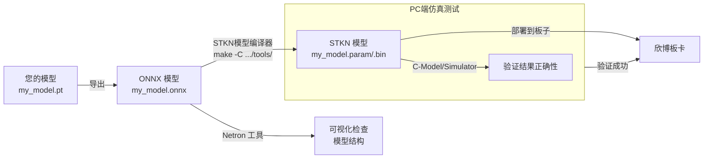

 


# 总体思路

~~*好吧这图其实是找AI帮画的*~~


# 准备工作
## 开发环境准备
厂家给的套件是linux版的，建议开发机系统是`Ubuntu 20.04`。太老了！我直接用Arch！反正都能用！他的工具链都是静态编译的怕啥！！！
~~***I use Arch BTW!***~~


解压他们厂家给的压缩包，里面有一个riscv64的编译器。把它再解压，然后要对它进行环境变量配置。
我是创建了`envsetup`脚本，`source`它一下就好了。文件如下：
``` shell
export STKN="$(pwd)" # 解压出来的大压缩包根目录，这个环境变量后面用得到。

export RISCV_TOOLCHAIN_PATH="$(pwd)/riscv64-unknown-linux-gnu" # 我把gcc放在上述目录下面了
export PATH="$RISCV_TOOLCHAIN_PATH/bin:$PATH"
export CC=riscv64-unknown-linux-gnu-gcc
export CXX=riscv64-unknown-linux-gnu-g++
export LD=riscv64-unknown-linux-gnu-ld
export AR=riscv64-unknown-linux-gnu-ar
export RANLIB=riscv64-unknown-linux-gnu-ranlib
export STRIP=riscv64-unknown-linux-gnu-strip
```


## 模型准备
### 转换为`onnx`格式
***二更！和甲方交流后得知这个东西其实是支持yolo v8的！所以后面会在v8相关的地方做注明。***

首先，你得要有一个已经训练好了的yolo模型。它可以是v5的，也可以是v7的。但我手里的是v8的，用不了（悲），就只能用他们厂家提供的了。

那么我们就要对模型进行格式转换。欣博他们有自己的一套框架，格式是`STKN`，由`xxx.bin`和`xxx.param`构成。为了兼容性，他们提供了一套工具用来把`onnx`模型转换成`STKN`格式的。~~*这一步怎么那么像LLVM的IR啊*~~。
所以第一步我们需要对模型进行格式转换。
这个是yolov8/v5的转换脚本(因为它们都来自`ultralytics`库)，完成后会生成同名`.onnx`文件：
```python
from ultralytics import YOLO

# 加载您训练好的模型
model = YOLO('my_model.pt')  # 确保路径正确

# 导出模型为 ONNX 格式
# - `opset=12`: ONNX运算符集版本，12是一个常用稳定版本。
# - `simplify=True`: 启用简化，会优化ONNX图结构，去除冗余算子，非常重要！
# - `dynamic=False`: 设为固定批次大小和输入尺寸，能大幅减少板端推理时的预处理开销，强烈建议开启。
success = model.export(format='onnx', opset=12, simplify=True, dynamic=False, imgsz=640)
```


### 转换为`STKN`格式
以yolov7为例，我们用这个命令转就行：
``` shell
make -C ${STKN}/tools \ # 指定 make 执行${STKN}/tools/Makefile
	onnx=${STKN}/models/yolov7-tiny/yolov7-tiny.onnx \ # 你的ONNX 模型文件
	image=${STKN}/images/COCO_val2017_500 \ # 量化模型时，校准所需的图片目录
	mean=0.0,0.0,0.0 \ # 减均值的 BGR 减去的数值
	norm=0.00392157,0.00392157,0.00392157 \ # 归一化的 BGR 乘以的数值
	shape=640,-1 \ # 量化模型时，将图像的宽度缩放为 640，高度保持宽高比
	pixel=RGB \ # 量化模型时，输入图像的格式
```
或者用我的这个v8命令：
``` shell
make -C ${STKN}/tools onnx=${STKN}/models/yolov8/yolov8.onnx image=${STKN}/images/COCO_val2017_500 mean=0.0,0.0,0.0 norm=0.00392157,0.00392157,0.00392157 shape=640,-1 pixel=RGB
```


# 对v8支持的测试
既然厂家说是支持v8的，但是文档和案例里都没给出相关代码。我这里记录下我的移植尝试：
## 修改MakeFile和cpp文件
先在`models`文件夹下创建`yolov8`文件夹，然后放入转换成`onnx`格式的`yolov8.onnx`，并创建如下`Makefile`:
``` Makefile
dir ?= $(abspath $(dir $(lastword $(MAKEFILE_LIST))))
stkn ?= $(abspath ${dir}/../..)

onnx ?= ${dir}/yolov8.onnx
table ?= ${dir}/yolov8.table
conf_threshold ?= 0.25

${dir}/yolov8.bin: ${onnx} ${table}
	make -C ${stkn}/tools onnx=${onnx} table=${table} conf_threshold=${conf_threshold}

```
复制`demo/yolov7-tiny.cpp` -> `demo/yolov8.cpp`，并将里面对`v7tiny`的引用改成`v8`的。

这里附上我改的，~~*不一定能运行*~~
``` cpp
#include "stkn.h"

namespace { struct Object
{
    cv::Rect_<float> rect;
    int label;
    float prob;
}; }

static const char* names[] = {"eye"};

static void draw_objects(cv::Mat& img, const std::vector<Object>& objects)
{
    for (const Object& obj : objects)
    {
        cv::rectangle(img, obj.rect, cv::Scalar(255, 0, 0));

        char text[256];
        int i = snprintf(text, sizeof(text), "%s %.0f%%", names[obj.label], obj.prob * 100);

        int baseLine = 0;
        cv::Size label_size = cv::getTextSize(text, cv::FONT_HERSHEY_SIMPLEX, 0.5, 1, &baseLine);

        int x = obj.rect.x;
        int y = obj.rect.y - label_size.height - baseLine;
        if (y < 0)
            y = 0;
        if (x + label_size.width > img.cols)
            x = img.cols - label_size.width;

        cv::rectangle(img, cv::Rect(cv::Point(x, y), cv::Size(label_size.width, label_size.height + baseLine)),
                      cv::Scalar(255, 255, 255), -1);

        cv::putText(img, text, cv::Point(x, y + label_size.height),
                    cv::FONT_HERSHEY_SIMPLEX, 0.5, cv::Scalar(0, 0, 0));
    }
}

#if USE_GTEST
extern "C" int test_yolov8(int argc, char** argv)
#else
int main(int argc, char** argv)
#endif
{
    tpu_init(0x20000000, 0x20000000);

    const std::unique_ptr<stkn::Net> net(stkn::net_create(
        (std::string(argv[1]) + "/yolov8.param").c_str(),
        (std::string(argv[1]) + "/yolov8.bin").c_str(),
        std::vector<const char*>{"259", "293", "327"}
    ));

    stkn::Mat yuv = stkn::imread(argv[2]);

    int t;
    tpu_us(&t);

    int dst_w = 640;
    int dst_h = 640;
    if (yuv.w < yuv.h)
        dst_w = dst_h * yuv.w / yuv.h + 16 & -32;
    else/*  */
        dst_h = dst_w * yuv.h / yuv.w + 16 & -32;
    float scale_w = (float)yuv.w / dst_w;
    float scale_h = (float)yuv.h / dst_h;

    stkn::Extractor ex(net.get());
#if YOLOV8_END2END
    ex.input_nv12(yuv.data, yuv.h, yuv.w, yuv.w, dst_h, dst_w, 1, 0, yuv.w * yuv.h, 0, 0, 640 - dst_h, 640 - dst_w);

    stkn::Mat out;
    ex("num_dets", out);

    std::vector<Object> objects(out.h);
    Object* obj = objects.data();
    const float* ptr = out;
    for (int i = 0; i < out.h; ++i) {
        obj->label = *ptr++ + 1; // +1 for prepend background class
        obj->prob = *ptr++;
        obj->rect.x = *ptr++ * scale_w;
        obj->rect.y = *ptr++ * scale_h;
        obj->rect.width = *ptr++ * scale_w - obj->rect.x;
        obj->rect.height = *ptr++ * scale_h - obj->rect.y;
        obj++;
    }
#else
    ex.input_nv12(yuv.data, yuv.h, yuv.w, yuv.w, dst_h, dst_w, 1, 0);

    std::vector<stkn::Mat> mats;
    ex(mats);

    fprintf(stderr, "yolov8 %fms\n", tpu_us(&t) / 1000.f);
    tpu_us(&t);

    const static std::vector<float> anchors{12.f, 16.f, 19.f, 36.f, 40.f, 28.f,
                                            36.f, 75.f, 76.f, 55.f, 72.f, 146.f,
                                            142.f, 110.f, 192.f, 243.f, 459.f, 401.f};
    float score_threshold = 0.25;
    float iou_threshold = 0.45;

    std::vector<std::unique_ptr<stkn::Object> > picked =
        stkn::yolov5_detect(net, mats, 8, anchors, score_threshold, iou_threshold);

    std::vector<Object> objects(picked.size());
    Object* obj = objects.data();
    for (const std::unique_ptr<stkn::Object>& src : picked) {
        obj->label = src->label + 1; // +1 for prepend background class
        obj->prob = src->prob;
        obj->rect.x = src->x0 * scale_w;
        obj->rect.y = src->y0 * scale_h;
        obj->rect.width = src->x1 * scale_w - obj->rect.x;
        obj->rect.height = src->y1 * scale_h - obj->rect.y;
        obj++;
    }
#endif

    fprintf(stderr, "yolov8 %fms\n", tpu_us(&t) / 1000.f);
    for (const Object& obj : objects)
        fprintf(stderr, "%s %.0f%% %.0f,%.0f %.0fx%.0f\n", names[obj.label], obj.prob * 100,
                obj.rect.x, obj.rect.y, obj.rect.width, obj.rect.height);

    stkn::Mat bgr = stkn::im2bgr(yuv);
    cv::Mat img(bgr.h, bgr.w, CV_8UC3, bgr.data);
    draw_objects(img, objects);
    cv::imwrite("yolov8.jpg", img);

    return 0;
}

```


## 添加单元测试
修改`demo/CMakeLists.txt`，在最后的`stkn_add_example`里依葫芦画瓢加上：
``` cmake
stkn_add_example(yolov8 ${models}/yolov8 ${images}/yolov8.jpg)
```
然后在`images`目录下创建`images/yolov8.jpg`，从别的地方找一张你的模型适用的图片就行。

# 编译主程序
我这里就编译了`C_MODEL`模式的，直接进入`demo`目录然后`make`就行。
完成后会在`demo/build-c_model`下生成`face_detect`, `plate_detect`, `yolov5s`, `yolov7-tiny`, `yolov7-tiny_float`五个可执行文件，我们接下来就可以用它们来进行识别了。
按照`yolov8`移植的做了之后，还会有个`yolov8`的二进制文件。


# 运行识别demo
我们使用`yolov7-tiny`来进行识别。
``` shell
LD_LIBRARY_PATH=${STKN}/c_model/lib ${STKN}/demo/build-c_model/yolov7-tiny ${STKN}/models/yolov7-tiny ${STKN}/images/bus.jpg
```
在添加`LD_LIBRARY_PATH`后，给`yolov7-tiny`这个二进制传递两个参数即可，第一个参数是模型所在文件夹，要包含`STKN`格式模型的两个文件，第二个参数是你要识别的图片。随后会将识别好带框的图片存在二进制程序所在目录下，和二进制程序同名的jpg。

`yolov8`的用法和上面的一样。

